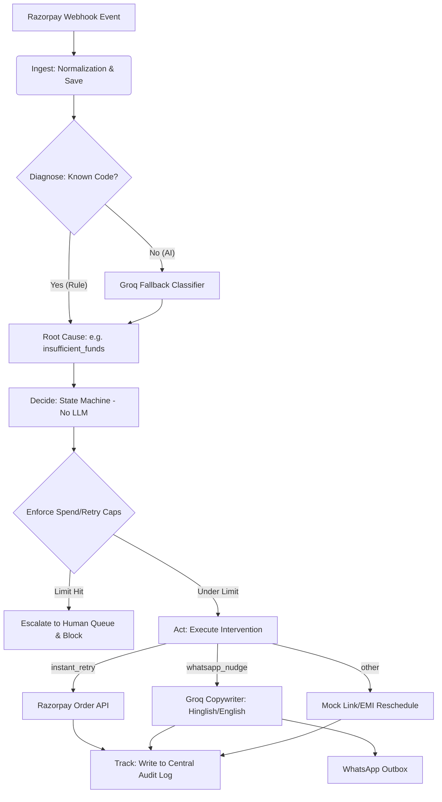

# Recoup — Root-Cause Revenue Recovery Agent

Submission for the **Razorpay Buildathon — AI Revenue Recovery Track**.

Recoup is an autonomous revenue recovery agent pipeline that detects failed or at-risk transactions, diagnoses the failure root cause, executes bounded recovery interventions (retries, localized WhatsApp reminders), tracks outcomes in a central append-only audit trail, and escalates unresolved cases to a human review queue.

## Pipeline Architecture Flow



---

## Architecture and Design Decisions

### 1. Crucial Rule: Strict AI-vs-Rules Split
This project implements a strict division between generative/heuristic AI decisions and deterministic control logic:
- **Where we USE AI (via Groq)**:
  - **Fallback Diagnosis**: Classifying ambiguous or free-text failure messages (e.g. *"bank timed out connecting to cardholder"* or *"declined by issuer due to no credit remaining"*) into standard codes.
  - **Copywriting**: Drafting personalized WhatsApp notification copies in natural **Hinglish** (for retail customer segments) and professional **English** (for SMB/Enterprise).
- **Where we NEVER use AI (Deterministic Code)**:
  - Money-moving decisions, transaction routing logic, spend limits, retry caps, and stop/opt-out rules are kept entirely in plain Python (`decide.py`).
  - This ensures 100% auditability, reproducibility, and prevents hallucinated routing or budget bypasses.

### 2. Groq Production Models Used
Groq's lineup was queried dynamically to ensure current production models are used:
- **Classifier Model**: `openai/gpt-oss-120b` (Large, high-reasoning general-purpose model for classification accuracy).
- **Drafting Model**: `openai/gpt-oss-20b` (Smaller, low-latency model for message copy generation).

Both models are run with a **5.0-second timeout** and a catch-all fallback path to `'needs_human_review'` to prevent pipeline blockages.

---

## Evaluation Performance Metrics

The pipeline was run against a synthetic batch of **52 transaction failures** spanning card declines, checkout abandonments, subscription failures, and overdue receivables.

| Metric | Value |
| :--- | :--- |
| **Total Ingested Transactions** | 52 |
| **Recovered Transactions** | 32 (61.54%) |
| **Escalated Transactions** | 20 (38.46%) |
| **Total At-Risk Revenue** | INR 2,358,150.00 |
| **Recovered Revenue** | INR 561,850.00 (23.83%) |
| **Average Touches to Recovery** | 1.06 |
| **Classifier Accuracy (Rules + Groq)** | **98.08%** |

### Audit Log Actor Counts
- **RULE**: 216 invocations (States, spend caps, retry limits)
- **AI**: 72 invocations (Groq text classification, Hinglish message drafting)
- **HUMAN**: 17 invocations (Simulated customer payments in response to nudges)

---

## How to Run the Project Locally

### Prerequisites
- Python 3.12+
- Node.js v18+ and npm v9+
- A valid Groq API Key and Razorpay Test Key pair (configured in `.env`)

### Setup and Installation

1. **Clone and Configure**:
   Create a `.env` file in the root directory (copy from `.env.example`):
   ```env
   GROQ_API_KEY=gsk_your_groq_key_here
   RAZORPAY_KEY_ID=rzp_test_your_key_here
   RAZORPAY_KEY_SECRET=your_secret_here
   DATABASE_URL=sqlite:///recoup.db
   ```

2. **Initialize Python Environment**:
   ```bash
   python -m venv .venv
   .venv\Scripts\activate
   pip install -r requirements.txt
   python api/db.py
   ```

3. **Initialize Dashboard Frontend**:
   ```bash
   cd dashboard
   npm install
   cd ..
   ```

### Running the Services

To view the system running on localhost:

1. **Start the FastAPI Backend** (Port 8000):
   ```bash
   .venv\Scripts\uvicorn api.ingest:app --reload --port 8000
   ```

2. **Start the React Dashboard** (Port 5173):
   ```bash
   cd dashboard
   npm run dev
   ```
   Open [http://localhost:5173](http://localhost:5173) in your browser to view the real-time KPI metrics, audit logs, outbox messages, and recovery charts.

3. **Run the Evaluation Script**:
   To populate the database and run the 52-record batch simulation:
   ```bash
   .venv\Scripts\python -m eval.run_eval
   ```

4. **Run Unit Tests**:
   ```bash
   .venv\Scripts\python -m pytest tests/test_decide.py
   .venv\Scripts\python -m pytest tests/test_diagnose.py
   ```

5. **Run Staged Failure Demos**:
   See [demo/staged_failure.md](file:///C:/Users/adaks/.gemini/antigravity/scratch/recoup/demo/staged_failure.md) for reproducible scripts demonstrating retry caps and API error resilience.
